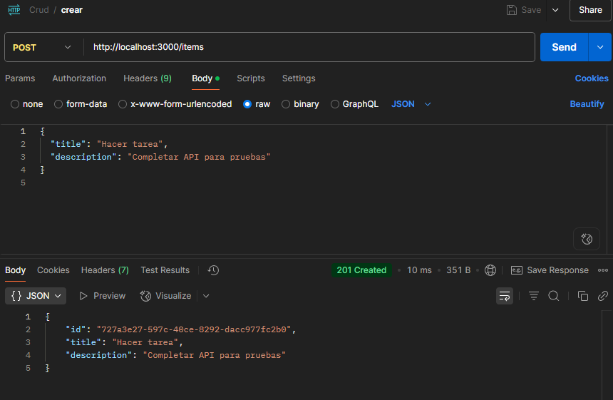

# To-Do List API

API REST sencilla con Node.js, Express y SQLite para gestionar tareas con pruebas y CI/CD.

---

## Endpoints

- `GET /items` – Listar todas las tareas
- `GET /items/:id` – Obtener una tarea por ID
- `POST /items` – Crear una nueva tarea
- `DELETE /items/:id` – Eliminar una tarea existente

---

## Evidencias en Postman

### Crear tarea (`POST /items`)



---

### Obtener todas las tareas (`GET /items`)


---

### Obtener tarea por ID (`GET /items/:id`)


---

### Eliminar tarea (`DELETE /items/:id`)


---

## Pruebas

Incluye:

- 3 pruebas unitarias
- 3 pruebas de integración
- 3 pruebas E2E

Ejecutar con:

```bash
npm test

---

### Resultado de pruebas ejecutadas


---

```
